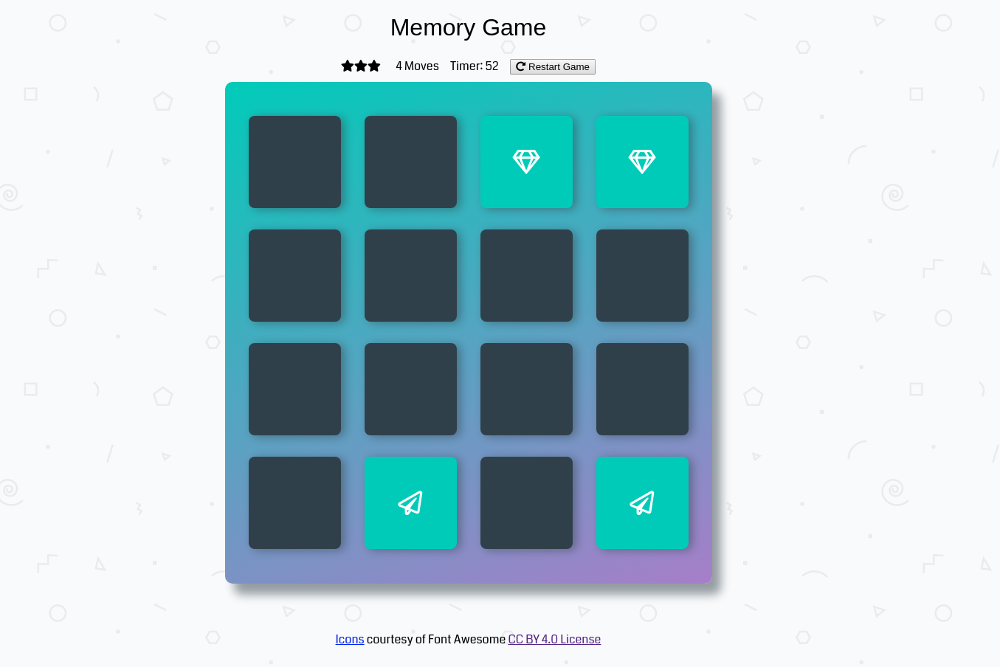

# Memory Game
--------

This repo serves as a home for the 'Memory Game' project in the Udacity [Frontend Web Development](https://www.udacity.com/course/front-end-web-developer-nanodegree--nd001) Nanodegree.

Instructions
--------

The live project is available [here](https://cynsdaemon.github.io/memory-game/). A modern web browser with JavaScript enabled is required. No other dependencies are necessary to run this game.

**To play:** A deck is made up of 16 cards. All cards have a matching pair hidden somewhere in the deck. The game and the game's timer starts when a player begins clicking on a card to flip it open. Each opened pair counts as a single move. The less moves a player makes, the greater their final star rating :star: :star: :star: will be.  Find all matching pairs to win the game! :sunglasses:

## Screenshot of Memory Game during play

Resources
--------

This project uses the following guides and libraries:

- Frontend Nanodegree [Style Guides](https://github.com/udacity/frontend-nanodegree-styleguide)
- Project Grading Rubric
- This repository contains starter code from Udacity's [Memory Game Project](https://github.com/udacity/fend-project-memory-game)
- Icons courtesy of Font Awesome [CC BY 4.0 License](https://fontawesome.com/license). Learn more about [Font Awesome](https://fontawesome.com/) and its [repository](https://github.com/FortAwesome/Font-Awesome).
- other Memory Game fonts by [Google Fonts](https://fonts.google.com/)

Contributions and Feedback
--------

For feedback and suggestions feel free to open an [issue on Github](https://github.com/cynsdaemon/memory-game/issues) for this project.

License
--------

This project is build with love :heart: coffee :coffee: and an awesome playlist :musical_note:. Copyright &copy; 2018 [Cynthia L. Wright](https://www.cynthialanel.com).

